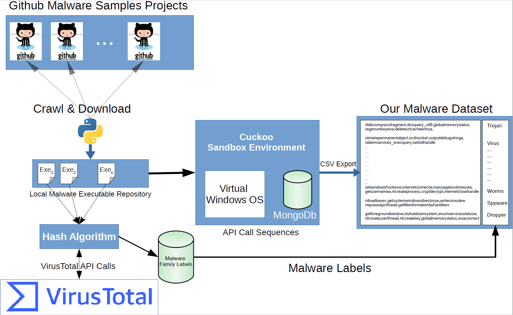

# The *Mal-API-2019* Dataset Description

**Cite The DataSet**  
If you find those results useful please cite them :

    @misc{ mal-api-2019,
       author = "Catak, FÖ. and Yazi, AF.",
       title = "A Benchmark API Call Dataset for Windows PE Malware Classification",
       year = "2019",
       url = "https://arxiv.org/abs/1905.01999",
       note = "[arXiv:1905.01999 ]"
     }

## Publications
The details of the **Mal-API-2019** dataset are published in following the papers:
* [[Link]](https://www.researchgate.net/publication/331974598_Classification_of_Methamorphic_Malware_with_Deep_Learning_LSTM) AF. Yazı, FÖ Çatak, E. Gül, *Classification of Metamorphic Malware with Deep Learning (LSTM)*, IEEE Signal Processing and Applications Conference, 2019.
* [[Link]](https://www.researchgate.net/publication/332877263_A_Benchmark_API_Call_Dataset_For_Windows_PE_Malware_Classification) Catak, FÖ., Yazi, AF., *A Benchmark API Call Dataset for Windows PE Malware Classification*, arXiv:1905.01999, 2019.

## Introduction
This study seeks to obtain data which will help to address machine learning based malware research gaps. The specific objective of this study is to build a benchmark dataset for Windows operating system API calls of various malware. This is the first study to undertake metamorphic malware to build sequential API calls. It is hoped that this research will contribute to a deeper understanding of how metamorphic malware change their behavior (i.e. API calls) by adding meaningless opcodes with their own dissembler/assembler parts.

## Malware Types and System Overall

In our research, we have translated the families produced by each of the software into 8 main malware families: *Trojan, Backdoor, Downloader, Worms, Spyware Adware, Dropper, Virus*. Table 1 shows the number of malware belonging to malware families in our data set. As you can see in the table, the number of samples of other malware families except *AdWare* is quite close to each other. There is such a difference because we don't find too much of malware from the adware malware family.

| **Malware Family** | **Samples** | **Description** | 
| ------------- |:-------------:|:-----|
| Spyware | 832 | enables a user to obtain covert information about another's computer activities by transmitting data covertly from their hard drive. |
|Downloader | 1001 | share the primary functionality of downloading content. |
|Trojan | 1001 | misleads users of its true intent.|
|Worms | 1001 | spreads copies of itself from computer to computer.|
|Adware | 379 | hides on your device and serves you advertisements.|
|Dropper | 891 |  surreptitiously carries viruses, back doors and other malicious software so they can be executed on the compromised machine. |
|Virus | 1001 | designed to spread from host to host and has the ability to replicate itself.|
|Backdoor | 1001 | a technique in which a system security mechanism is bypassed undetectably to access a computer or its data. |

Figure shows the general flow of the generation of the malware data set. As shown in the figure, we have obtained the MD5 hash values of the malware we collect from Github. We searched these hash values using the VirusTotal API, and we have obtained the families of these malicious software from the reports of 67 different antivirus software in VirusTotal. We have observed that the malicious software families found in the reports of these 67 different antivirus software in VirusTotal are different. 

## Data Description
* [Sample dataset](https://raw.githubusercontent.com/ocatak/malware_api_class/master/sample_analysis_data.csv)
* [labels](https://raw.githubusercontent.com/ocatak/malware_api_class/master/labels.csv)
* [all dataset](https://raw.githubusercontent.com/ocatak/malware_api_class/master/mal-api-2019.zip)

